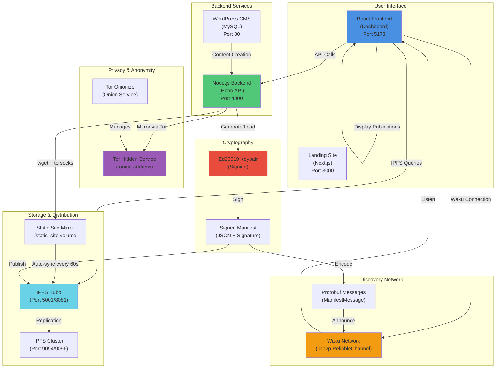
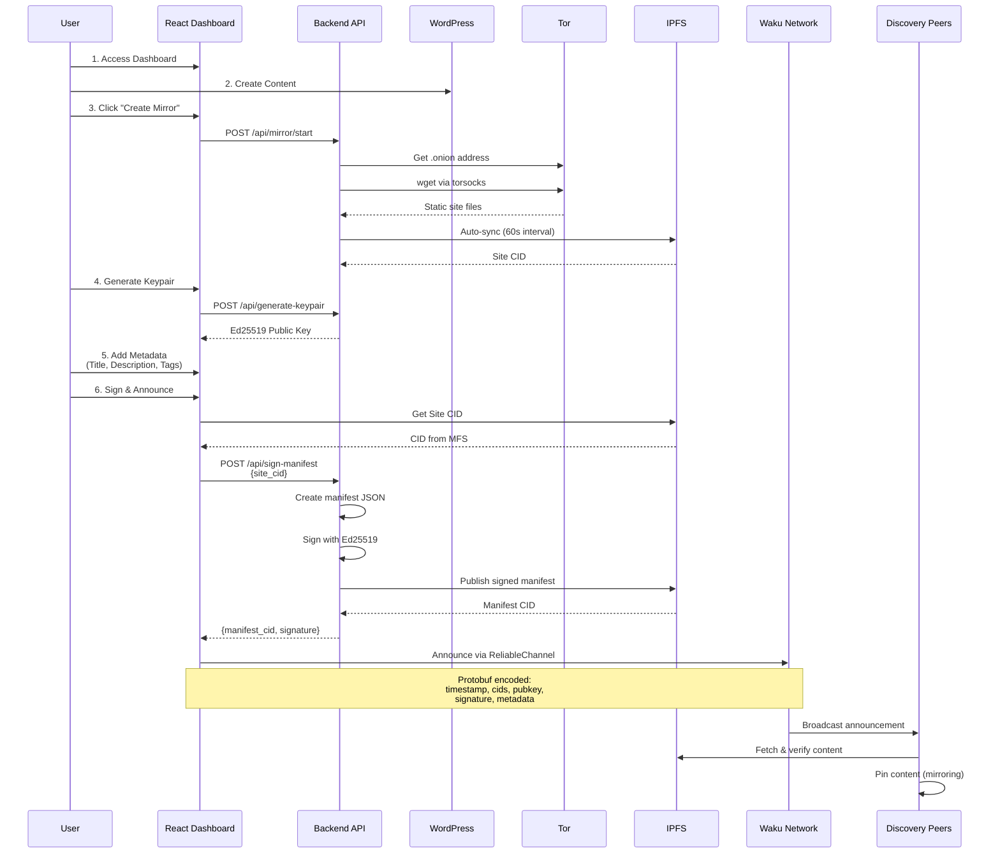
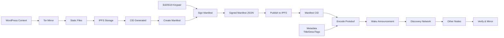
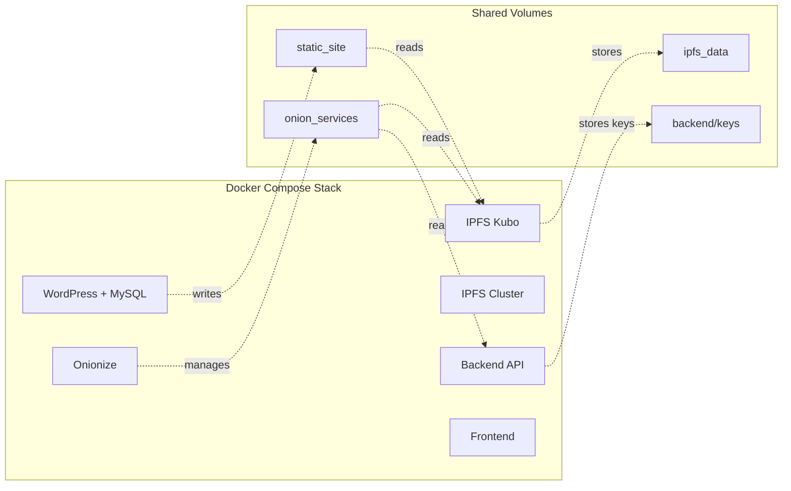
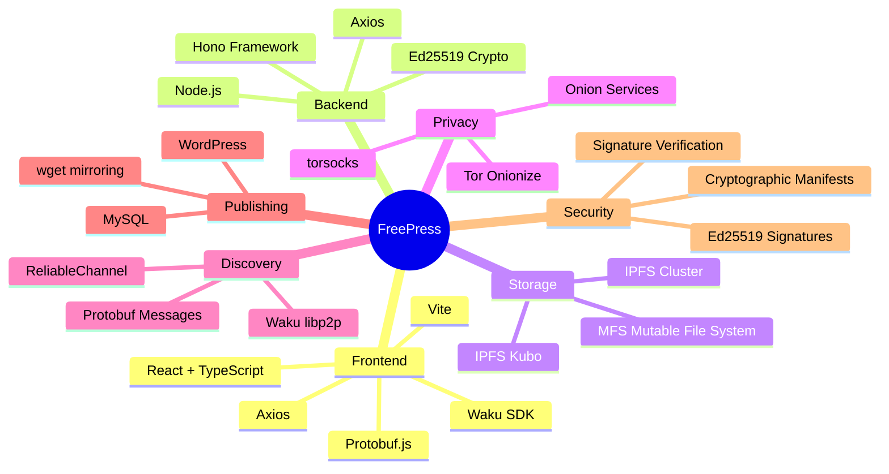
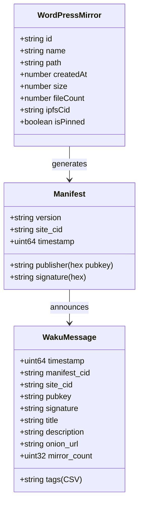
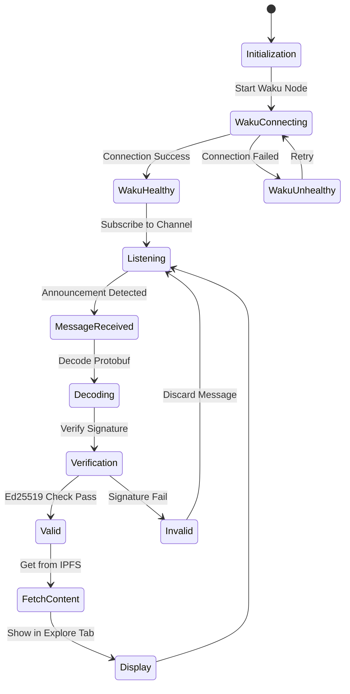
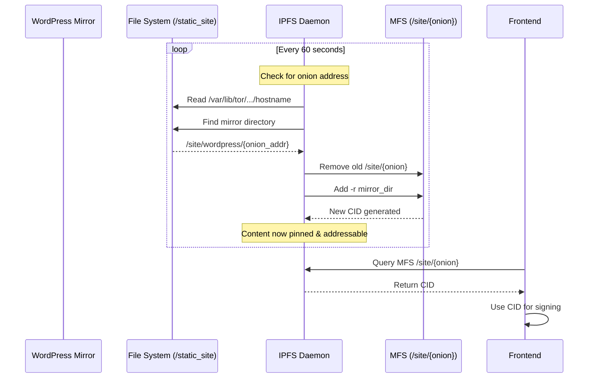

# FreePress Architecture

## System Architecture Diagram

## Publishing Flow

## Data Flow

## Component Integration

## Technology Stack

## Manifest Structure

## Network Discovery Flow

## IPFS Sync Process

## Key Features

### ✅ Implemented
- WordPress local publishing
- Tor onion service integration
- Static site mirroring via wget + torsocks
- IPFS automatic syncing (60s intervals)
- Ed25519 keypair generation & storage
- Manifest signing
- IPFS manifest publishing (on-chain)
- Waku P2P discovery network
- Protobuf message encoding
- Real-time CID fetching from IPFS MFS
- Publication metadata (title, description, tags)
- Cryptographic signature verification UI
- Multi-tab dashboard (Publish, Explore, Mirror, Settings)

### 🔄 Architecture Highlights
- **Decentralized**: No central servers, all P2P
- **Censorship-resistant**: Tor + IPFS + Waku
- **Cryptographically signed**: Ed25519 for authenticity
- **Privacy-preserving**: Onion services, no accounts
- **Resilient**: Content persists via IPFS pinning
- **Discoverable**: Waku announcements for network-wide visibility

