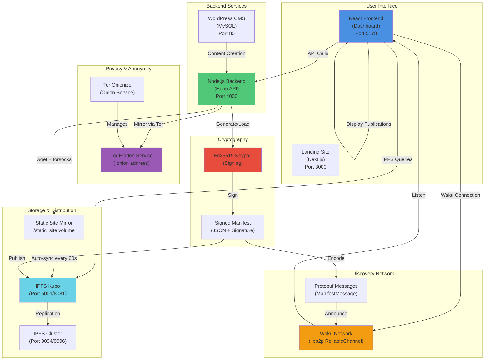
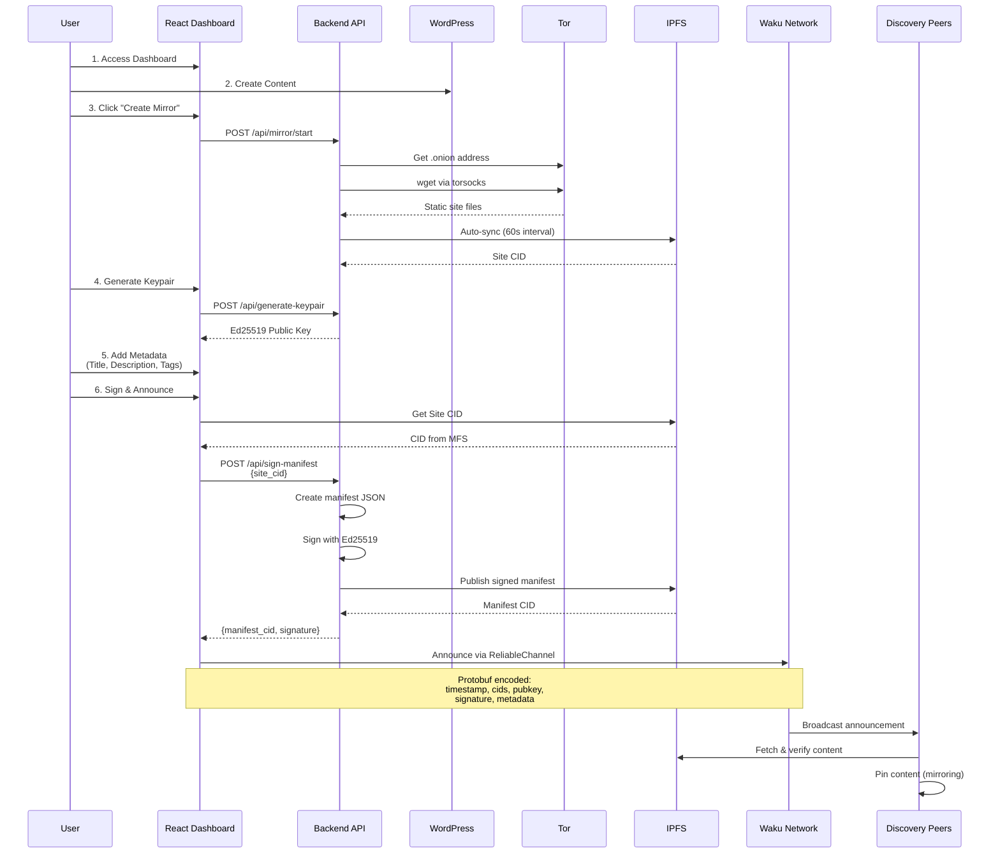

# FreePress 🕊️

> **Publish Without Permission** - Private, Censorship-Proof, Autonomous Publishing

FreePress is a resilient anonymous publishing system that empowers journalists, activists, and communities to publish and discover content without centralized infrastructure, surveillance, or censorship.

## **Track:** 

### 📰 Resilient Anonymous Publishing  
 
FreePress directly addresses the *Resilient Anonymous Publishing* challenge by building a censorship-proof, privacy-preserving publishing stack that runs entirely on the user’s local machine. It replaces centralized platforms like WordPress.com with a self-contained system that integrates **Tor onion routing** for anonymous access, **IPFS** for decentralized storage, and **Waku/libp2p** for peer-to-peer discovery without metadata leakage.  

Publishers can create and sign content locally, mirror it over Tor, and announce it to the Waku network—ensuring persistence even if the original node goes offline. Every publication is cryptographically signed with **Ed25519 keys**, enabling verifiable authenticity without revealing identity.  

### 🥷 Resilient Activist Technology  

FreePress empowers activists to publish and share information securely under hostile conditions. It combines **Tor**, **IPFS**, and **Waku/libp2p** to enable anonymous publishing, decentralized storage, and censorship-resistant discovery—without relying on central servers.  

By running locally, using **Ed25519** cryptographic signing, and mirroring content across peer nodes, FreePress ensures that activist communications remain private, verifiable, and resilient against surveillance or takedowns.


## Slide Deck - https://freepress--l1ctnxe.gamma.site/

## 🌍 Why FreePress?

The ability to publish freely is under threat from:
- Centralized platform censorship
- Government surveillance and takedowns
- Domain seizures and DNS blocking
- De-anonymization and tracking

FreePress solves this by running **locally on your machine**, serving content over **Tor** and **IPFS**, with decentralized **Waku/libp2p** discovery.


## 🧩 Architecture


## ✨ Features

- 🖥️ **Local-first** - Runs on your computer, not someone else's cloud
- 🔒 **Private by design** - No accounts, no tracking, no central servers
- 🌐 **Resilient network** - IPFS + Waku/libp2p for unstoppable discovery
- 🧩 **Familiar tools** - Use WordPress or Ghost inside containerized stack
- 🪶 **Anonymous discovery** - Explore publishers without metadata leakage
- 🔄 **Auto-mirroring** - Content persists even when publisher goes offline

## 🚀 Quick Start

### Prerequisites

- [Docker](https://docs.docker.com/get-docker/) (v20.10+)
- [Docker Compose](https://docs.docker.com/compose/install/) (v2.0+)
- 4GB RAM minimum
- 10GB free disk space

### Installation

1. **Clone the repository**
```bash
git clone https://github.com/Shubham-Rasal/FreePress.git
cd FreePress
```

2. **Start the stack**
```bash
docker compose up -d
```

3. **Access the dashboard**
Open your browser to:
- **Dashboard**: http://localhost:5173
- **Landing Site**: http://localhost:3000
- **WordPress**: http://localhost:80

That's it! Your FreePress node is now running.


### System Overview



### Publishing Flow



### Services

| Service | Port | Description |
|---------|------|-------------|
| **Dashboard** | 5173 | React frontend UI (Vite) |
| **Landing Site** | 3000 | Next.js marketing site |
| **Backend API** | 4000 | Node.js REST API (Hono) |
| **WordPress** | 80 | CMS for content creation |
| **IPFS Gateway** | 8081 | IPFS HTTP gateway |
| **IPFS API** | 5001 | IPFS RPC API |
| **IPFS Cluster** | 9094 | IPFS Cluster REST API |
| **MySQL** | - | WordPress database (internal) |
| **Tor** | - | Onion service (internal) |
| **Waku** | - | P2P discovery (client-side) |

## 📖 Usage

### 1. Access the Dashboard

Visit **http://localhost:5173** to access the FreePress Dashboard with tabs:
- **Publish**: Mirror, sign, and announce your WordPress content
- **Mirror**: View and manage WordPress site mirrors
- **Settings**: Configure your node

### 2. Create Content

Access WordPress at **http://localhost:80** to create posts and pages.

### 3. Create a Mirror

In the Dashboard's **Publish** tab:
1. Click "Create New Mirror" to generate a static copy via Tor
2. Wait for automatic IPFS sync (every 60 seconds)
3. Click "Refresh CIDs" to check if your mirror is available

### 4. Sign & Announce

Still in the **Publish** tab:
1. Click "Generate Keypair" to create your Ed25519 identity
2. Add publication metadata (title, description, tags)
3. Click "Sign & Announce" to publish your manifest to IPFS and broadcast to Waku

### 5. Verify Your Publication

- Your **Tor Onion URL** is displayed at the top
- Your **Site CID** and **Manifest CID** appear after signing
- Your content is now discoverable on the Waku network

## 🛠️ Development

### Project Structure

```
FreePress/
├── backend/          # Node.js API (Hono)
│   ├── src/
│   │   ├── index.ts
│   │   └── routes/
│   │       ├── crypto.ts      # Ed25519 signing
│   │       └── mirror.ts      # Tor mirroring
│   ├── keys/                  # Ed25519 keypairs
│   └── package.json
├── frontend/         # React dashboard (Vite)
│   ├── src/
│   │   ├── components/
│   │   │   ├── PublishTab.tsx
│   │   │   ├── MirrorTab.tsx
│   │   │   └── SettingsTab.tsx
│   │   ├── hooks/
│   │   │   └── useWakuDiscovery.tsx
│   │   └── Dashboard.tsx
│   └── package.json
├── site/             # Next.js landing page
│   └── src/app/
└── docker-compose.yml
```

### Technology Stack

| Layer | Technology | Purpose |
|-------|-----------|---------|
| **Frontend** | React + TypeScript + Vite | Interactive dashboard UI |
| **Backend** | Node.js + Hono Framework | REST API for signing & mirroring |
| **CMS** | WordPress + MySQL | Content creation |
| **Privacy** | Tor (onionize-docker) | Anonymous .onion services |
| **Storage** | IPFS Kubo + Cluster | Decentralized content storage |
| **Discovery** | Waku (libp2p ReliableChannel) | P2P announcement network |
| **Crypto** | Ed25519 | Digital signatures for manifests |
| **Serialization** | Protobuf.js | Efficient message encoding |
| **Mirroring** | wget + torsocks | Static site generation via Tor |

### Key Features Implemented

✅ **WordPress Integration**: Local CMS with MySQL database  
✅ **Tor Mirroring**: Automatic .onion service generation  
✅ **IPFS Sync**: Auto-sync mirrors to IPFS every 60 seconds  
✅ **Ed25519 Signing**: Cryptographic manifest signatures  
✅ **Waku Discovery**: P2P content announcements  
✅ **Manifest Publishing**: On-chain (IPFS) manifest storage  
✅ **Publication Metadata**: Title, description, tags for discovery  
✅ **CID Verification**: Real-time IPFS CID fetching from MFS  

### Available Commands

```bash
# Start all services
docker compose up -d

# View logs
docker compose logs -f

# View logs for specific service
docker compose logs -f backend

# Stop all services
docker compose down

# Rebuild after code changes
docker compose up -d --build

# Reset everything (⚠️ deletes all data)
docker compose down -v
```

## 🔐 Security & Privacy

### What FreePress Protects

✅ **Publisher anonymity** - .onion addresses hide your IP  
✅ **Content integrity** - Ed25519 signatures prevent tampering  
✅ **Censorship resistance** - IPFS mirrors keep content alive  
✅ **Discovery privacy** - Bloom filters prevent metadata leakage  

### What FreePress Doesn't Protect

❌ **Content of posts** - Posts are public once published  
❌ **WordPress login** - Secure your WP admin with strong passwords  
❌ **Network traffic** - Use Tor Browser to access .onion addresses  

### Best Practices

1. **Keep keys secure** - Backup your Ed25519 keypair
2. **Use strong passwords** - For WordPress admin access
3. **Run behind Tor** - Access .onion addresses via Tor Browser only
4. **Rotate keys** - For high-risk publishing scenarios
5. **Monitor mirrors** - Ensure at least 3 nodes mirror your content

## 🗓️ Roadmap

### Week 1 - MVP (Current)

- [x] Day 1: Docker compose + basic dashboard
- [x] Day 2: IPFS publishing + manifest signing
- [x] Day 3: Tor integration + onion display
- [x] Day 4: Waku/libp2p discovery
- [x] Day 5: UI polish + mirror functionality
- [x] Day 6: Resilience testing
- [x] Day 7: Packaging + demo

### Phase 2 - Enhanced Discovery

- [x] Curator lists & trust system
- [x] Bloom-filter private search
- [ ] Encrypted keyword search
- [ ] Tag-based filtering

### Phase 3 - Long-term Persistence

- [x] Filecoin integration
- [ ] Arweave backup
- [ ] web3.storage pinning
- [x] Automatic backup scheduling

### Phase 4 - Better UX

- [ ] Electron desktop app
- [ ] Mobile reader app
- [ ] Browser extension
- [ ] One-click installer

## 🤝 Contributing

Contributions are welcome! This project is built for a critical need - helping people publish freely under censorship.

### Areas Needing Help

- **Security audit** - Review cryptography and Tor setup
- **UX design** - Make it accessible to non-technical users
- **Documentation** - Guides for journalists and activists
- **Testing** - Real-world censorship scenarios
- **Translations** - Localize for different regions

See [CONTRIBUTING.md](CONTRIBUTING.md) for guidelines.

## 📄 License

MIT License - See [LICENSE](LICENSE) file for details.

## 🙏 Acknowledgments

Built for the **Internet Archive Europe** challenge: *Resilient Anonymous Publishing*

Inspired by:
- [Tor Project](https://www.torproject.org/)
- [IPFS](https://ipfs.tech/)
- [Waku](https://waku.org/)
- [OnionPress](https://github.com/torservers/onionpress)
- [SecureDrop](https://securedrop.org/)

## 📞 Support

- 📖 [Documentation](./docs/)
- 🐛 [Report Issues](https://github.com/yourusername/FreePress/issues)
- 💬 [Discussions](https://github.com/yourusername/FreePress/discussions)
- 🔐 [Security Policy](./SECURITY.md)

---

**Remember**: Free speech is a human right. This tool is designed to protect that right.

*"The only way to deal with an unfree world is to become so absolutely free that your very existence is an act of rebellion."* - Albert Camus

